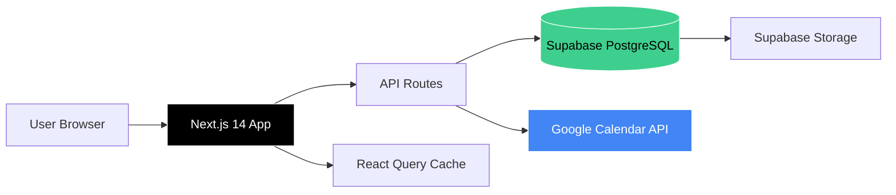

# 📊 Bloomberg Personal

> A comprehensive productivity system for managing goals, career applications, university courses, and daily tasks — all in one place.

[](https://nextjs.org/)
[](https://www.typescriptlang.org/)
[](https://supabase.com/)
[](https://opensource.org/licenses/MIT)

---

## ✨ Features

### 🎯 Dashboard Command Center (`/today`)
- **3-column layout** with Focus Tasks, Today's Schedule, and Progress Stats
- **Smart task aggregation** from goals, career interviews, study exercises, and manual tasks
- **Real-time sync** with Google Calendar
- **Urgency-based color coding** for exams and deadlines

### 🎓 University System (`/university`)
- **Course management** with ECTS, semester, and exam date tracking
- **Exercise checkboxes** (Blatt 1-N) with progress visualization
- **Exam countdown** with urgency indicators (🔴 <45d, 🟡 45-60d, 🔵 >60d)
- **Auto-populated study tasks** on the Dashboard

### 🎯 Goals Tracking (`/goals`)
- **CRUD operations** with categories (Career, Wellness, Learning, Finance, Personal)
- **Priority levels** (Low, Medium, High) with visual indicators
- **Progress tracking** with completion statistics
- **Weekly/Monthly/Yearly views**

### 💼 Career Management (`/career`)
- **Job applications tracker** (Applied → Interview → Offer/Rejected)
- **CV upload & storage** via Supabase Storage
- **CV text extraction** from PDF/DOCX for auto-filling application forms
- **Interview scheduling** with automatic Dashboard integration
- **Career stats dashboard** (applications, interviews, offer rate)

### 📅 Calendar Integration (`/calendar`)
- **Google Calendar OAuth** connection
- **Week view** of all events
- **Today's schedule** displayed on Dashboard
- **Disconnect/reconnect** functionality

---

## 🏗️ Architecture



---

## 🛠️ Tech Stack

| Category | Technology |
|----------|-----------|
| **Framework** | Next.js 14 (App Router) |
| **Language** | TypeScript 5 |
| **Database** | Supabase (PostgreSQL) |
| **ORM/Client** | @supabase/supabase-js |
| **Data Fetching** | TanStack React Query v5 |
| **Validation** | Zod |
| **Styling** | Tailwind CSS |
| **Forms** | React Hook Form + @hookform/resolvers |
| **Icons** | Lucide React |
| **Date Handling** | date-fns |
| **File Parsing** | pdf-parse, mammoth (DOCX) |
| **External API** | Google Calendar API (googleapis) |
| **Testing** | Vitest + @testing-library/react |

---

## 🚀 Quick Start

### Prerequisites
- **Node.js** 18+ and npm
- **Supabase account** (free tier works)
- **Google Cloud project** (for Calendar API, optional)

### Installation

1. **Clone the repository**
   ```bash
   git clone https://github.com/yourusername/bloomberg-personal.git
   cd bloomberg-personal
   ```

2. **Install dependencies**
   ```bash
   npm install
   ```

3. **Set up environment variables**
   
   Create a `.env.local` file in the root directory:
   ```env
   # Supabase
   NEXT_PUBLIC_SUPABASE_URL=https://your-project.supabase.co
   NEXT_PUBLIC_SUPABASE_ANON_KEY=your-anon-key

   # Google Calendar (Optional)
   GOOGLE_CLIENT_ID=your-client-id.apps.googleusercontent.com
   GOOGLE_CLIENT_SECRET=your-client-secret
   GOOGLE_REDIRECT_URI=http://localhost:3000/api/auth/google/callback
   ```

   > **Note:** `.env.local` is gitignored. Never commit credentials.

4. **Set up Supabase database**
   
   Run the SQL migrations in your Supabase dashboard (SQL Editor):
   - See [`docs/DATABASE.md`](docs/DATABASE.md) for full schema
   - Tables: `goals`, `job_applications`, `courses`, `exercise_progress`, `daily_tasks`
   - Storage: Create a `cv-uploads` bucket

5. **Seed initial data (optional)**
   ```bash
   npm run seed
   ```

6. **Start development server**
   ```bash
   npm run dev
   ```

   Open [http://localhost:3000](http://localhost:3000) in your browser.

---

## 📝 Environment Variables

| Variable | Description | Required |
|----------|-------------|----------|
| `NEXT_PUBLIC_SUPABASE_URL` | Your Supabase project URL | ✅ Yes |
| `NEXT_PUBLIC_SUPABASE_ANON_KEY` | Supabase anonymous/public key | ✅ Yes |
| `GOOGLE_CLIENT_ID` | Google OAuth 2.0 Client ID | ⚠️ For Calendar |
| `GOOGLE_CLIENT_SECRET` | Google OAuth 2.0 Client Secret | ⚠️ For Calendar |
| `GOOGLE_REDIRECT_URI` | OAuth callback URL | ⚠️ For Calendar |

---

## 📜 Available Scripts

| Command | Description |
|---------|-------------|
| `npm run dev` | Start development server (localhost:3000) |
| `npm run build` | Build production bundle |
| `npm run test` | Run unit tests with Vitest |
| `npm run test:ui` | Open Vitest UI |
| `npm run test:coverage` | Generate test coverage report |
| `npm run seed` | Seed database with sample goals |
| `npm run fix-courses` | Fix missing exercise_progress entries |
| `npm run type-check` | Run TypeScript compiler checks |
| `npm run lint` | Run ESLint |

---

## 📂 Project Structure

```
bloomberg-personal/
├── app/
│   ├── (dashboard)/          # Dashboard routes (grouped layout)
│   │   ├── today/            # Main dashboard page
│   │   ├── goals/            # Goals management
│   │   ├── career/           # Job applications tracker
│   │   ├── university/       # Courses & exercises
│   │   ├── calendar/         # Google Calendar integration
│   │   └── layout.tsx        # Shared dashboard layout (sidebar + header)
│   ├── api/                  # API routes (server-side)
│   │   ├── goals/            # Goals CRUD
│   │   ├── applications/     # Career applications CRUD
│   │   ├── courses/          # University courses CRUD
│   │   ├── daily-tasks/      # Manual tasks CRUD
│   │   ├── calendar/         # Google Calendar fetch
│   │   ├── dashboard/        # Dashboard aggregation endpoints
│   │   └── auth/google/      # Google OAuth flow
│   ├── globals.css           # Global Tailwind styles
│   ├── layout.tsx            # Root layout
│   └── page.tsx              # Home/landing page
├── components/
│   ├── features/             # Feature-specific components
│   │   ├── dashboard/        # FocusTasks, StatusDashboard, ScheduleColumn
│   │   ├── goals/            # GoalCard, GoalForm, GoalModal
│   │   ├── career/           # ApplicationCard, CvUpload, ApplicationStats
│   │   ├── university/       # CourseCard, CourseModal
│   │   └── calendar/         # EventCard
│   ├── layout/               # Layout components (Header, Sidebar)
│   ├── providers/            # React Query provider
│   └── ui/                   # Reusable UI components (buttons, etc.)
├── lib/
│   ├── supabase/             # Supabase client & database functions
│   │   ├── client.ts         # Server-side client
│   │   ├── browserClient.ts  # Client-side client
│   │   ├── types.ts          # Database types (generated)
│   │   ├── goals.ts          # Goals DB operations
│   │   ├── courses.ts        # Courses DB operations
│   │   └── applications.ts   # Applications DB operations
│   ├── schemas/              # Zod validation schemas
│   │   ├── goal.schema.ts
│   │   ├── course.schema.ts
│   │   ├── application.schema.ts
│   │   └── dailyTask.schema.ts
│   ├── google/               # Google Calendar API integration
│   │   └── calendar.ts
│   ├── api/                  # Frontend API client functions
│   └── utils/                # Utility functions
├── scripts/
│   ├── seedGoals.ts          # Seed script for sample data
│   └── fixCourseExercises.ts # Fix missing exercise entries
├── tests/
│   ├── unit/                 # Unit tests
│   └── integration/          # Integration tests
├── docs/                     # Documentation
│   ├── API.md                # API endpoint reference
│   ├── DATABASE.md           # Database schema & ERD
│   ├── FEATURES.md           # Feature descriptions
│   └── SETUP.md              # Setup guide
├── types/                    # Custom TypeScript types
├── tailwind.config.ts        # Tailwind configuration
├── next.config.js            # Next.js configuration
├── tsconfig.json             # TypeScript configuration
├── vitest.config.ts          # Vitest configuration
└── package.json              # Dependencies & scripts
```

---

## 🔧 Development Workflow

1. **Create a feature branch**
   ```bash
   git checkout -b feature/your-feature-name
   ```

2. **Make changes** and test locally with `npm run dev`

3. **Run tests**
   ```bash
   npm run test
   npm run type-check
   npm run lint
   ```

4. **Commit and push**
   ```bash
   git add .
   git commit -m "feat: your feature description"
   git push origin feature/your-feature-name
   ```

5. **Open a Pull Request** on GitHub

---

## 🚢 Deployment

### Deploy to Vercel (Recommended)

1. **Push to GitHub** (already done)

2. **Import project in Vercel**
   - Go to [vercel.com/new](https://vercel.com/new)
   - Import your GitHub repository
   - Vercel auto-detects Next.js configuration

3. **Add environment variables** in Vercel dashboard:
   - `NEXT_PUBLIC_SUPABASE_URL`
   - `NEXT_PUBLIC_SUPABASE_ANON_KEY`
   - `GOOGLE_CLIENT_ID` (optional)
   - `GOOGLE_CLIENT_SECRET` (optional)
   - `GOOGLE_REDIRECT_URI` (update to your Vercel domain)

4. **Deploy** 🚀
   - Vercel automatically deploys on every push to `main`
   - Production URL: `https://your-app.vercel.app`

### Google OAuth Setup for Production
- Update redirect URI in Google Cloud Console to `https://your-app.vercel.app/api/auth/google/callback`
- Add authorized domain in Google Cloud Console

---

## 📚 Documentation

- **[API Reference](docs/API.md)** - Complete API endpoint documentation
- **[Database Schema](docs/DATABASE.md)** - ERD and table definitions
- **[Features Guide](docs/FEATURES.md)** - Detailed feature descriptions and workflows
- **[Setup Guide](docs/SETUP.md)** - Step-by-step setup for new developers

---

## 🤝 Contributing

Contributions are welcome! Please follow these guidelines:

1. Fork the repository
2. Create a feature branch (`git checkout -b feature/AmazingFeature`)
3. Commit your changes (`git commit -m 'feat: Add AmazingFeature'`)
4. Push to the branch (`git push origin feature/AmazingFeature`)
5. Open a Pull Request

**Code Style:**
- Use TypeScript strict mode
- Follow ESLint rules (`npm run lint`)
- Write tests for new features
- Use conventional commit messages (feat, fix, docs, etc.)

---

## 🐛 Troubleshooting

### Common Issues

**Issue:** "Missing Supabase environment variables"
- **Fix:** Ensure `.env.local` exists and contains valid Supabase credentials

**Issue:** "Failed to fetch courses" or "No study tasks showing"
- **Fix:** Run `npm run fix-courses` to create missing exercise_progress entries

**Issue:** Google Calendar not working
- **Fix:** Check redirect URI matches exactly in Google Cloud Console

**Issue:** RLS policy errors in Supabase
- **Fix:** Ensure RLS policies allow anonymous/public access (or implement auth)

See [`docs/SETUP.md`](docs/SETUP.md) for more troubleshooting tips.

---

## 📄 License

This project is licensed under the **MIT License** - see the [LICENSE](LICENSE) file for details.

---

## 🙏 Acknowledgments

- Built with [Next.js](https://nextjs.org/)
- Powered by [Supabase](https://supabase.com/)
- UI components styled with [Tailwind CSS](https://tailwindcss.com/)
- Icons by [Lucide](https://lucide.dev/)

---

## 📧 Contact

For questions or feedback, open an issue on GitHub or reach out via:
- **GitHub:** https://github.com/Innisfree7x/
- **Email:** vietdobusiness@gmail.com

---

<div align="center">
  <strong>Built with ❤️ for productivity enthusiasts</strong>
</div>
