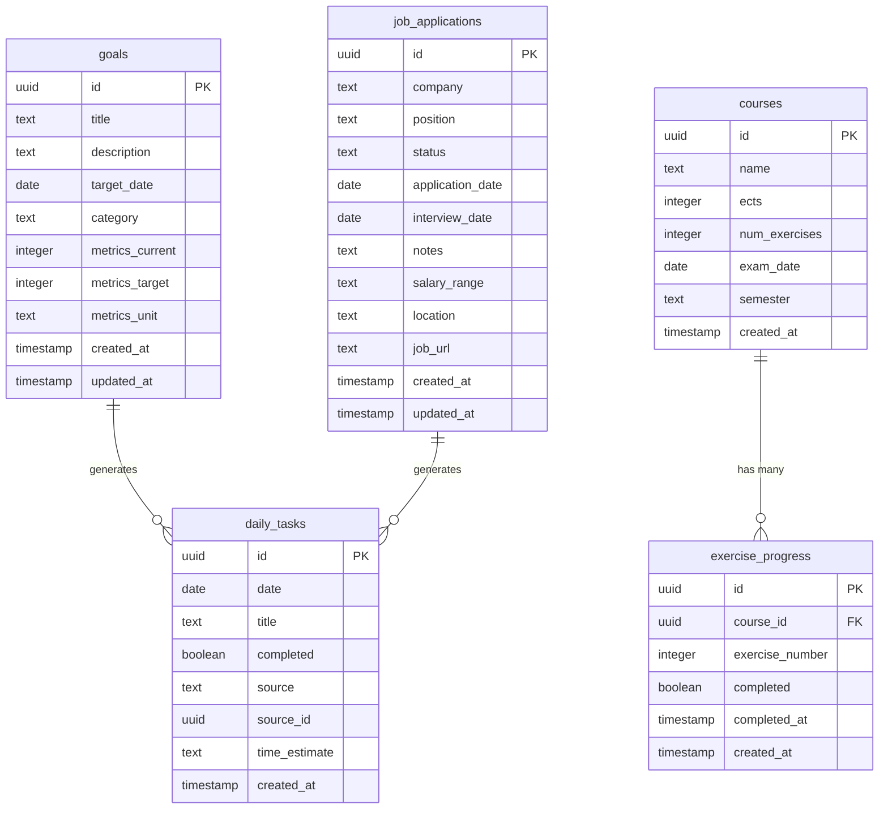

# 🗄️ Database Schema

Complete database documentation for Bloomberg Personal (Supabase PostgreSQL).

---

## Table of Contents

- [Entity Relationship Diagram](#entity-relationship-diagram)
- [Tables](#tables)
  - [goals](#goals)
  - [job_applications](#job_applications)
  - [courses](#courses)
  - [exercise_progress](#exercise_progress)
  - [daily_tasks](#daily_tasks)
- [Storage Buckets](#storage-buckets)
- [RLS Policies](#rls-policies)
- [Indexes](#indexes)
- [SQL Migrations](#sql-migrations)

---

## Entity Relationship Diagram



---

## Tables

### goals

Stores user goals with categories, deadlines, and progress metrics.

**Columns:**

| Column | Type | Constraints | Description |
|--------|------|-------------|-------------|
| `id` | `uuid` | PRIMARY KEY, DEFAULT `uuid_generate_v4()` | Unique identifier |
| `title` | `text` | NOT NULL | Goal title (1-200 chars) |
| `description` | `text` | NULLABLE | Detailed description |
| `target_date` | `date` | NOT NULL | Deadline for goal completion |
| `category` | `text` | NOT NULL | One of: `Career`, `Wellness`, `Learning`, `Finance`, `Personal` |
| `metrics_current` | `integer` | NULLABLE | Current progress value |
| `metrics_target` | `integer` | NULLABLE | Target progress value |
| `metrics_unit` | `text` | NULLABLE | Unit of measurement (e.g., "hours", "pages") |
| `created_at` | `timestamp` | DEFAULT `now()` | Creation timestamp |
| `updated_at` | `timestamp` | NULLABLE | Last update timestamp |

**Example:**

```sql
INSERT INTO goals (title, description, target_date, category, metrics_current, metrics_target, metrics_unit)
VALUES (
  'Complete TypeScript Course',
  'Finish all 20 modules and build a final project',
  '2024-12-31',
  'Learning',
  8,
  20,
  'modules'
);
```

**Indexes:**
- PRIMARY KEY on `id`
- INDEX on `category` for filtering
- INDEX on `target_date` for deadline queries

---

### job_applications

Tracks job applications, interviews, and offers.

**Columns:**

| Column | Type | Constraints | Description |
|--------|------|-------------|-------------|
| `id` | `uuid` | PRIMARY KEY, DEFAULT `uuid_generate_v4()` | Unique identifier |
| `company` | `text` | NOT NULL | Company name |
| `position` | `text` | NOT NULL | Job title/position |
| `status` | `text` | NOT NULL, CHECK | One of: `applied`, `interview`, `offer`, `rejected` |
| `application_date` | `date` | NOT NULL | Date applied |
| `interview_date` | `date` | NULLABLE | Scheduled interview date |
| `notes` | `text` | NULLABLE | Application notes (max 2000 chars) |
| `salary_range` | `text` | NULLABLE | Expected salary range |
| `location` | `text` | NULLABLE | Job location |
| `job_url` | `text` | NULLABLE | Link to job posting |
| `created_at` | `timestamp` | DEFAULT `now()` | Creation timestamp |
| `updated_at` | `timestamp` | DEFAULT `now()` | Last update timestamp |

**Example:**

```sql
INSERT INTO job_applications (company, position, status, application_date, interview_date, location)
VALUES (
  'Google',
  'Software Engineer',
  'interview',
  '2024-01-10',
  '2024-01-25',
  'Mountain View, CA'
);
```

**Indexes:**
- PRIMARY KEY on `id`
- INDEX on `status` for filtering
- INDEX on `interview_date` for dashboard queries

**Constraints:**
```sql
ALTER TABLE job_applications
ADD CONSTRAINT status_check 
CHECK (status IN ('applied', 'interview', 'offer', 'rejected'));
```

---

### courses

Stores university courses with ECTS, exam dates, and semester info.

**Columns:**

| Column | Type | Constraints | Description |
|--------|------|-------------|-------------|
| `id` | `uuid` | PRIMARY KEY, DEFAULT `uuid_generate_v4()` | Unique identifier |
| `name` | `text` | NOT NULL | Course name (1-200 chars) |
| `ects` | `integer` | NOT NULL, CHECK (1-15) | ECTS credits |
| `num_exercises` | `integer` | NOT NULL, CHECK (1-20) | Total number of exercises |
| `exam_date` | `date` | NULLABLE | Exam date (if scheduled) |
| `semester` | `text` | NOT NULL | Semester (e.g., "WS 2024/25") |
| `created_at` | `timestamp` | DEFAULT `now()` | Creation timestamp |

**Example:**

```sql
INSERT INTO courses (name, ects, num_exercises, exam_date, semester)
VALUES (
  'Operations Research',
  6,
  12,
  '2025-02-15',
  'WS 2024/25'
);
```

**Indexes:**
- PRIMARY KEY on `id`
- INDEX on `exam_date` for urgency queries
- INDEX on `semester` for filtering

**Constraints:**
```sql
ALTER TABLE courses
ADD CONSTRAINT ects_range CHECK (ects >= 1 AND ects <= 15),
ADD CONSTRAINT num_exercises_range CHECK (num_exercises >= 1 AND num_exercises <= 20);
```

---

### exercise_progress

Tracks completion status of individual course exercises.

**Columns:**

| Column | Type | Constraints | Description |
|--------|------|-------------|-------------|
| `id` | `uuid` | PRIMARY KEY, DEFAULT `uuid_generate_v4()` | Unique identifier |
| `course_id` | `uuid` | FOREIGN KEY → `courses(id)`, ON DELETE CASCADE | Related course |
| `exercise_number` | `integer` | NOT NULL, CHECK (>= 1) | Exercise number (Blatt 1, 2, ...) |
| `completed` | `boolean` | NOT NULL, DEFAULT `false` | Completion status |
| `completed_at` | `timestamp` | NULLABLE | Timestamp when completed |
| `created_at` | `timestamp` | DEFAULT `now()` | Creation timestamp |

**Example:**

```sql
-- Auto-created when a course is created
INSERT INTO exercise_progress (course_id, exercise_number, completed)
VALUES 
  ('course-uuid', 1, false),
  ('course-uuid', 2, false),
  ('course-uuid', 3, true);
```

**Indexes:**
- PRIMARY KEY on `id`
- INDEX on `course_id` for fast course lookups
- UNIQUE INDEX on `(course_id, exercise_number)` to prevent duplicates
- INDEX on `completed` for filtering incomplete tasks

**Foreign Key:**
```sql
ALTER TABLE exercise_progress
ADD CONSTRAINT fk_course
FOREIGN KEY (course_id) REFERENCES courses(id)
ON DELETE CASCADE;
```

**Cascade Behavior:**
- Deleting a course automatically deletes all related `exercise_progress` entries

---

### daily_tasks

Stores manual tasks and auto-generated tasks from goals/applications.

**Columns:**

| Column | Type | Constraints | Description |
|--------|------|-------------|-------------|
| `id` | `uuid` | PRIMARY KEY, DEFAULT `uuid_generate_v4()` | Unique identifier |
| `date` | `date` | NOT NULL | Task date |
| `title` | `text` | NOT NULL | Task description (1-500 chars) |
| `completed` | `boolean` | NOT NULL, DEFAULT `false` | Completion status |
| `source` | `text` | NULLABLE | Task source: `manual`, `goal`, `application` |
| `source_id` | `uuid` | NULLABLE | UUID of related goal/application |
| `time_estimate` | `text` | NULLABLE | Estimated duration (e.g., "30m", "2h") |
| `created_at` | `timestamp` | DEFAULT `now()` | Creation timestamp |

**Example:**

```sql
-- Manual task
INSERT INTO daily_tasks (date, title, completed, source, time_estimate)
VALUES ('2024-11-20', 'Review PR #123', false, 'manual', '30m');

-- Auto-generated from goal
INSERT INTO daily_tasks (date, title, source, source_id, completed)
VALUES ('2024-11-20', 'Finish presentation slides', 'goal', 'goal-uuid', false);
```

**Indexes:**
- PRIMARY KEY on `id`
- INDEX on `date` for daily queries
- INDEX on `(date, completed)` for filtering incomplete tasks
- INDEX on `source_id` for tracing origin

**Constraints:**
```sql
ALTER TABLE daily_tasks
ADD CONSTRAINT source_check 
CHECK (source IN ('manual', 'goal', 'application') OR source IS NULL);
```

---

## Storage Buckets

### cv-uploads

Stores uploaded CV files (PDF/DOCX).

**Configuration:**
- **Bucket Name:** `cv-uploads`
- **Public Access:** No (private by default)
- **File Size Limit:** 10 MB
- **Allowed MIME Types:**
  - `application/pdf`
  - `application/msword`
  - `application/vnd.openxmlformats-officedocument.wordprocessingml.document`

**Example Upload (JavaScript):**

```javascript
const { data, error } = await supabase.storage
  .from('cv-uploads')
  .upload(`cv-${userId}-${Date.now()}.pdf`, file, {
    cacheControl: '3600',
    upsert: false,
  });
```

**Example Fetch (Public URL):**

```javascript
const { data } = supabase.storage
  .from('cv-uploads')
  .getPublicUrl('cv-uuid.pdf');

console.log(data.publicUrl);
```

---

## RLS Policies

Row Level Security (RLS) policies control data access.

### Current Setup: Public Access

For development/demo purposes, tables use **public read/write** policies:

```sql
-- Enable RLS
ALTER TABLE goals ENABLE ROW LEVEL SECURITY;
ALTER TABLE job_applications ENABLE ROW LEVEL SECURITY;
ALTER TABLE courses ENABLE ROW LEVEL SECURITY;
ALTER TABLE exercise_progress ENABLE ROW LEVEL SECURITY;
ALTER TABLE daily_tasks ENABLE ROW LEVEL SECURITY;

-- Allow anonymous access (development only)
CREATE POLICY "Allow all access" ON goals FOR ALL USING (true);
CREATE POLICY "Allow all access" ON job_applications FOR ALL USING (true);
CREATE POLICY "Allow all access" ON courses FOR ALL USING (true);
CREATE POLICY "Allow all access" ON exercise_progress FOR ALL USING (true);
CREATE POLICY "Allow all access" ON daily_tasks FOR ALL USING (true);
```

### Recommended Production Policies

For production with Supabase Auth:

```sql
-- Goals: Users can only access their own goals
CREATE POLICY "Users can view own goals"
ON goals FOR SELECT
USING (auth.uid() = user_id);

CREATE POLICY "Users can insert own goals"
ON goals FOR INSERT
WITH CHECK (auth.uid() = user_id);

CREATE POLICY "Users can update own goals"
ON goals FOR UPDATE
USING (auth.uid() = user_id);

CREATE POLICY "Users can delete own goals"
ON goals FOR DELETE
USING (auth.uid() = user_id);
```

**Note:** Add `user_id uuid REFERENCES auth.users(id)` column to all tables for user isolation.

---

## Indexes

Indexes improve query performance for common operations.

**Goals:**
```sql
CREATE INDEX idx_goals_category ON goals(category);
CREATE INDEX idx_goals_target_date ON goals(target_date);
CREATE INDEX idx_goals_created_at ON goals(created_at DESC);
```

**Job Applications:**
```sql
CREATE INDEX idx_applications_status ON job_applications(status);
CREATE INDEX idx_applications_interview_date ON job_applications(interview_date) WHERE interview_date IS NOT NULL;
CREATE INDEX idx_applications_created_at ON job_applications(created_at DESC);
```

**Courses:**
```sql
CREATE INDEX idx_courses_exam_date ON courses(exam_date) WHERE exam_date IS NOT NULL;
CREATE INDEX idx_courses_semester ON courses(semester);
```

**Exercise Progress:**
```sql
CREATE INDEX idx_exercise_course_id ON exercise_progress(course_id);
CREATE INDEX idx_exercise_completed ON exercise_progress(completed) WHERE completed = false;
CREATE UNIQUE INDEX idx_exercise_unique ON exercise_progress(course_id, exercise_number);
```

**Daily Tasks:**
```sql
CREATE INDEX idx_tasks_date ON daily_tasks(date);
CREATE INDEX idx_tasks_date_completed ON daily_tasks(date, completed);
CREATE INDEX idx_tasks_source_id ON daily_tasks(source_id) WHERE source_id IS NOT NULL;
```

---

## SQL Migrations

### Initial Schema Creation

Run these SQL commands in Supabase SQL Editor:

**1. Enable UUID Extension:**

```sql
CREATE EXTENSION IF NOT EXISTS "uuid-ossp";
```

**2. Create Tables:**

```sql
-- Goals Table
CREATE TABLE goals (
  id UUID PRIMARY KEY DEFAULT uuid_generate_v4(),
  title TEXT NOT NULL CHECK (char_length(title) >= 1 AND char_length(title) <= 200),
  description TEXT,
  target_date DATE NOT NULL,
  category TEXT NOT NULL CHECK (category IN ('Career', 'Wellness', 'Learning', 'Finance', 'Personal')),
  metrics_current INTEGER,
  metrics_target INTEGER,
  metrics_unit TEXT,
  created_at TIMESTAMP WITH TIME ZONE DEFAULT now(),
  updated_at TIMESTAMP WITH TIME ZONE
);

-- Job Applications Table
CREATE TABLE job_applications (
  id UUID PRIMARY KEY DEFAULT uuid_generate_v4(),
  company TEXT NOT NULL,
  position TEXT NOT NULL,
  status TEXT NOT NULL CHECK (status IN ('applied', 'interview', 'offer', 'rejected')),
  application_date DATE NOT NULL,
  interview_date DATE,
  notes TEXT,
  salary_range TEXT,
  location TEXT,
  job_url TEXT,
  created_at TIMESTAMP WITH TIME ZONE DEFAULT now(),
  updated_at TIMESTAMP WITH TIME ZONE DEFAULT now()
);

-- Courses Table
CREATE TABLE courses (
  id UUID PRIMARY KEY DEFAULT uuid_generate_v4(),
  name TEXT NOT NULL CHECK (char_length(name) >= 1 AND char_length(name) <= 200),
  ects INTEGER NOT NULL CHECK (ects >= 1 AND ects <= 15),
  num_exercises INTEGER NOT NULL CHECK (num_exercises >= 1 AND num_exercises <= 20),
  exam_date DATE,
  semester TEXT NOT NULL,
  created_at TIMESTAMP WITH TIME ZONE DEFAULT now()
);

-- Exercise Progress Table
CREATE TABLE exercise_progress (
  id UUID PRIMARY KEY DEFAULT uuid_generate_v4(),
  course_id UUID NOT NULL REFERENCES courses(id) ON DELETE CASCADE,
  exercise_number INTEGER NOT NULL CHECK (exercise_number >= 1),
  completed BOOLEAN NOT NULL DEFAULT false,
  completed_at TIMESTAMP WITH TIME ZONE,
  created_at TIMESTAMP WITH TIME ZONE DEFAULT now(),
  UNIQUE(course_id, exercise_number)
);

-- Daily Tasks Table
CREATE TABLE daily_tasks (
  id UUID PRIMARY KEY DEFAULT uuid_generate_v4(),
  date DATE NOT NULL,
  title TEXT NOT NULL CHECK (char_length(title) >= 1 AND char_length(title) <= 500),
  completed BOOLEAN NOT NULL DEFAULT false,
  source TEXT CHECK (source IN ('manual', 'goal', 'application')),
  source_id UUID,
  time_estimate TEXT,
  created_at TIMESTAMP WITH TIME ZONE DEFAULT now()
);
```

**3. Create Indexes:**

```sql
-- Goals indexes
CREATE INDEX idx_goals_category ON goals(category);
CREATE INDEX idx_goals_target_date ON goals(target_date);

-- Job Applications indexes
CREATE INDEX idx_applications_status ON job_applications(status);
CREATE INDEX idx_applications_interview_date ON job_applications(interview_date) WHERE interview_date IS NOT NULL;

-- Courses indexes
CREATE INDEX idx_courses_exam_date ON courses(exam_date) WHERE exam_date IS NOT NULL;

-- Exercise Progress indexes
CREATE INDEX idx_exercise_course_id ON exercise_progress(course_id);
CREATE INDEX idx_exercise_completed ON exercise_progress(completed) WHERE completed = false;

-- Daily Tasks indexes
CREATE INDEX idx_tasks_date ON daily_tasks(date);
CREATE INDEX idx_tasks_date_completed ON daily_tasks(date, completed);
```

**4. Enable RLS (Development Mode):**

```sql
ALTER TABLE goals ENABLE ROW LEVEL SECURITY;
ALTER TABLE job_applications ENABLE ROW LEVEL SECURITY;
ALTER TABLE courses ENABLE ROW LEVEL SECURITY;
ALTER TABLE exercise_progress ENABLE ROW LEVEL SECURITY;
ALTER TABLE daily_tasks ENABLE ROW LEVEL SECURITY;

CREATE POLICY "Allow all access" ON goals FOR ALL USING (true);
CREATE POLICY "Allow all access" ON job_applications FOR ALL USING (true);
CREATE POLICY "Allow all access" ON courses FOR ALL USING (true);
CREATE POLICY "Allow all access" ON exercise_progress FOR ALL USING (true);
CREATE POLICY "Allow all access" ON daily_tasks FOR ALL USING (true);
```

**5. Create Storage Bucket:**

```sql
-- In Supabase Dashboard: Storage > Create Bucket
-- Name: cv-uploads
-- Public: false
```

---

## Performance Considerations

### Query Optimization Tips

1. **Use Indexes for Filtering:**
   ```sql
   -- Good: Uses idx_goals_category
   SELECT * FROM goals WHERE category = 'Career';
   
   -- Bad: Full table scan
   SELECT * FROM goals WHERE LOWER(category) = 'career';
   ```

2. **Limit Result Sets:**
   ```sql
   -- Dashboard query: Only fetch incomplete tasks
   SELECT * FROM daily_tasks 
   WHERE date = CURRENT_DATE AND completed = false
   LIMIT 10;
   ```

3. **Use JOIN Instead of Multiple Queries:**
   ```sql
   -- Efficient: Single query
   SELECT c.*, COUNT(ep.id) FILTER (WHERE ep.completed) as completed_count
   FROM courses c
   LEFT JOIN exercise_progress ep ON c.id = ep.course_id
   GROUP BY c.id;
   ```

4. **Partial Indexes for Common Filters:**
   ```sql
   -- Only index incomplete exercises (saves space)
   CREATE INDEX idx_incomplete_exercises 
   ON exercise_progress(course_id) 
   WHERE completed = false;
   ```

---

## Backup and Maintenance

### Automated Backups (Supabase)

Supabase provides:
- **Daily backups** (free tier: 7 days retention)
- **Point-in-time recovery** (paid plans)
- **Manual snapshots** via Dashboard

### Manual Backup (pg_dump)

```bash
pg_dump -h db.your-project.supabase.co \
  -U postgres \
  -d postgres \
  --schema=public \
  --file=backup-$(date +%Y%m%d).sql
```

### Data Cleanup Scripts

```sql
-- Delete old completed tasks (older than 30 days)
DELETE FROM daily_tasks 
WHERE completed = true 
AND date < CURRENT_DATE - INTERVAL '30 days';

-- Archive old job applications
UPDATE job_applications 
SET status = 'archived' 
WHERE status = 'rejected' 
AND created_at < CURRENT_DATE - INTERVAL '90 days';
```

---

## Future Enhancements

Potential schema improvements:

- [ ] Add `user_id` column for multi-user support
- [ ] Create `tags` table for flexible categorization
- [ ] Add `attachments` table for goal-related files
- [ ] Implement `audit_log` for change tracking
- [ ] Add `notifications` table for reminders
- [ ] Create `habits` table for recurring tasks
- [ ] Add `comments` table for goal discussions

---

<div align="center">
  <strong>For API usage, see <a href="./API.md">API Documentation</a></strong>
</div>
