# ✨ Features Guide

Comprehensive guide to all Prism features with workflows and usage examples.

---

## Table of Contents

- [Dashboard Command Center](#dashboard-command-center)
- [Goals System](#goals-system)
- [Career Management](#career-management)
- [University System](#university-system)
- [Calendar Integration](#calendar-integration)
- [Onboarding & Profile](#onboarding--profile)
- [Command Bar V2](#command-bar-v2)
- [User Workflows](#user-workflows)

---

## Onboarding & Profile

### Onboarding Gate

- Route: `/onboarding`
- Trigger: authenticated user with `user_metadata.onboarding_completed !== true`
- Purpose: ensure every account has initial personalization before entering dashboard routes.

### Profile Persistence

- Route: `/settings`
- Display name is persisted via Server Action to Supabase auth `user_metadata.full_name`.
- Successful update refreshes auth context, so sidebar/header pick up the change immediately.

---

## Command Bar V2

### Open

- Shortcut: `Cmd+K` (macOS) / `Ctrl+K` (Windows/Linux)

### Action Groups

- Navigation: jump directly to all dashboard areas.
- Themes: switch or cycle themes (includes Gold mode).
- Focus Timer: start/pause/resume/stop timer.
- Quick Actions:
  - New Goal
  - New Course
  - New Application
  - Start Next Best Action
  - Start Focus Session (25m)
  - Start Deep Focus (50m)

### In-App Action Bridge

- Commands trigger page-level actions directly (not URL query hacks).
- If action is triggered from another route, it is queued and executed on arrival.

---

## Dashboard Command Center

**Route:** `/today`

The main command center that aggregates all tasks, events, and progress in one place.

### Layout

**3-Column Grid (Desktop):**

```
┌────────────────┬────────────────┬────────────────┐
│  Focus Today   │    Schedule    │     Stats      │
│  (Left Col)    │  (Middle Col)  │  (Right Col)   │
├────────────────┼────────────────┼────────────────┤
│ • Career Tasks │ • Calendar     │ • Career Stats │
│ • Study Tasks  │   Events       │ • Goals Stats  │
│ • Goal Tasks   │ • Meetings     │ • Study Stats  │
│ • Manual Tasks │ • Deadlines    │ • Quick Metrics│
└────────────────┴────────────────┴────────────────┘
```

**Mobile:** Stacks vertically (Schedule → Focus → Stats)

---

### Left Column: Focus Today

Aggregates high-priority tasks from multiple sources.

### Next Best Action Engine

- A dedicated widget surfaces exactly one recommended action with the highest current impact.
- Uses clean-architecture ranking logic (`lib/application/use-cases/execution-engine.ts`) based on:
  - urgency (overdue/today/soon)
  - impact
  - effort
- Includes two fallback alternatives if the primary action is dropped.
- 3 action modes:
  - `Do now`: executes directly where possible (task complete, exercise complete, or context jump)
  - `Plan later`: converts the action into a tomorrow task
  - `Drop`: dismisses recommendation for the current day session
- Shows a `Daily Execution Score` (0-100) derived from completion momentum and backlog pressure.

#### Task Sources

1. **🎓 Study Tasks**
   - First incomplete exercise from each course
   - Sorted by exam urgency (nearest first)
   - Color-coded by days until exam:
     - 🔴 Red: < 45 days (urgent)
     - 🟡 Yellow: 45-60 days (important)
     - 🔵 Blue: > 60 days or no exam (normal)
   - Example: `Operations Research: Blatt 6 (Exam in 25d)`

2. **💼 Career Tasks**
   - Upcoming interviews (next 7 days)
   - Example: `LEA Partners - Interview in 2d`

3. **🎯 Goal Tasks**
   - Goals due today or overdue
   - Sorted by target date

4. **✍️ Manual Tasks**
   - User-created daily tasks
   - Example: `Review PR #123 (30m)`

#### Task Behavior

- **Checkbox Click:** Mark task as completed → Immediately remove from list
- **Optimistic Updates:** UI updates instantly, API call in background
- **Study Tasks:** Checking off an exercise automatically shows the next incomplete exercise from the same course
- **Empty State:** Shows "✅ All caught up!" when no tasks

#### Adding Quick Tasks

- Input field at bottom: "Add quick task..."
- Press Enter to create instant task
- Defaults to today's date, `manual` source

---

### Middle Column: Schedule

Displays today's Google Calendar events in chronological order.

#### Event Card

```
┌──────────────────────────────┐
│ 14:00 - 15:00               │
│ Team Meeting                 │
│ 📍 Conference Room A        │
└──────────────────────────────┘
```

**Fields:**
- Time range (start - end)
- Event title
- Location (if available)
- Description (collapsed, expandable)

#### Features

- **Real-time Sync:** Fetches from Google Calendar API
- **Relative Times:** "Starting in 2h" for upcoming events
- **Past Events:** Slightly dimmed opacity
- **Empty State:** "No events scheduled for today"
- **Refresh Button:** Manual sync trigger

---

### Right Column: Stats Dashboard

#### Career Stats

```
💼 Career Tracker
──────────────────
Applications: 15
Interviews: 5
Offers: 2
Success Rate: 13%

Next Interview:
Google - 2 days
```

**Metrics:**
- Total applications by status (applied, interview, offer, rejected)
- Success rate: `(Offers / Total Applications) × 100`
- Next upcoming interview with countdown

---

#### Goals Progress

```
🎯 Goals Progress
──────────────────
This Week: 3/8 completed

By Category:
Career: ████░ 80%
Learning: ███░░ 60%
Wellness: ██░░░ 40%

⚠️ 2 overdue goals
```

**Metrics:**
- Weekly completion rate
- Progress by category (visual bar + percentage)
- Overdue goals count (with warning icon)

---

#### Study Progress

```
📚 Study Progress
──────────────────
This Week: 5/48 exercises
Semester: 42% complete

Next: OR in 25 days
```

**Metrics:**
- Exercises completed this week / total exercises across all courses
- Overall semester completion percentage
- Next exam (course name + days until)

---

#### Quick Metrics

```
⚡ Today's Focus
──────────────────
Tasks Today: 7
Completed: 3
Remaining: 4
```

**Real-time Stats:**
- Total tasks for today
- Completed count
- Remaining tasks

---

## Goals System

**Route:** `/goals`

Comprehensive goal management with categories, priorities, and progress tracking.

### Goal Card

```
┌─────────────────────────────────────┐
│ 🎯 Learn TypeScript                │
│ Category: learning                  │
│ Due: Dec 31, 2024 (41 days left)   │
│                                     │
│ Progress: ████████░░ 8/10 modules  │
│                                     │
│ "Complete all modules and build a  │
│  project with React + TypeScript"  │
│                                     │
│ [ Edit ] [ Delete ] [ ✓ Complete ] │
└─────────────────────────────────────┘
```

### Categories

- **fitness:** Exercise, sports, health goals
- **career:** Job applications, networking, skill development
- **learning:** Courses, books, certifications
- **finance:** Savings, investments, budgeting

### Progress Tracking

**Metrics System:**
- `metrics_current`: Current value (e.g., 8)
- `metrics_target`: Goal value (e.g., 10)
- `metrics_unit`: Unit of measurement (e.g., "modules", "hours", "pages")

**Visual Display:**
- Progress bar: `(current / target) × 100%`
- Text: "8/10 modules (80%)"

### Goal Lifecycle


### CRUD Operations

**Create Goal:**
1. Click "+ Add Goal" button
2. Fill form:
   - Title (required, 3-100 chars)
   - Description (optional)
   - Category (required, dropdown: fitness, career, learning, finance)
   - Target Date (required, date picker)
   - Metrics (optional: current, target, unit)
3. Click "Save" → Goal appears in list

**Edit Goal:**
1. Click "Edit" button on goal card
2. Modify fields in modal
3. Click "Update" → Changes saved

**Delete Goal:**
1. Click "Delete" button on goal card
2. Confirm deletion (modal: "Are you sure?")
3. Goal removed from database (CASCADE deletes related daily tasks)

**Complete Goal:**
1. Click "✓ Complete" button
2. Goal marked as completed, dimmed in list
3. Option to archive or delete

### Views

**All Goals (Default):**
- Shows all active goals
- Sorted by: Due Date (Nearest → Farthest)

**By Category:**
- Tabs: All | fitness | career | learning | finance
- Filter by selected category

**Completed Goals:**
- Toggle: "Show Completed"
- Grayed out with checkmark
- Option to reopen

**Overdue Goals:**
- Red badge: "⚠️ Overdue"
- Automatically filtered to top of list

---

## Career Management

**Route:** `/career`

Track job applications, interviews, CV uploads, and career stats.

### Job Application Tracker

#### Application States


**Status Labels:**
- **applied** (Blue): Application submitted, awaiting response
- **interview** (Yellow): Interview scheduled or completed
- **offer** (Green): Job offer received
- **rejected** (Red): Application unsuccessful

---

### Application Card

```
┌────────────────────────────────────┐
│ Google                     [INTER] │
│ Software Engineer                  │
│                                    │
│ 📅 Applied: Jan 10, 2024          │
│ 🎤 Interview: Jan 25, 2024 (2d)  │
│ 📍 Mountain View, CA              │
│ 💰 $120k - $180k                  │
│                                    │
│ "Behavioral + 2 coding rounds"    │
│                                    │
│ [ Edit ] [ Delete ] [ Update ]    │
└────────────────────────────────────┘
```

### Career Stats Dashboard

**Top Section:**

```
📊 Application Summary
───────────────────────
Total: 15
Applied: 8 (53%)
Interview: 5 (33%)
Offer: 2 (13%)

Success Rate: 13%
Interview Rate: 33%
```

**Upcoming Interviews:**

```
🎤 Next Interviews
───────────────────────
→ Google - Jan 25 (2d)
→ Meta - Jan 28 (5d)
→ Amazon - Feb 1 (9d)
```

---

### CV Upload & Management

**Upload Flow:**

1. Click "Upload CV" button
2. Select file (PDF or DOCX, max 10 MB)
3. File uploads to Supabase Storage (`cv-uploads` bucket)
4. Backend extracts text using:
   - `pdf-parse` for PDFs
   - `mammoth` for DOCX files
5. Extracted text displayed in preview modal
6. Option to auto-fill application form with parsed data

**CV Text Extraction:**

```javascript
// Example extracted data
{
  "text": "John Doe\nSoftware Engineer\n\nSkills: TypeScript, React, Node.js\n\nExperience:\n- Google (2020-2023)\n- Microsoft (2018-2020)",
  "fileUrl": "https://supabase.co/storage/v1/object/public/cv-uploads/cv-uuid.pdf"
}
```

**Auto-fill Application:**
- Parse CV for company names, positions, dates
- Pre-fill "Application Form" fields
- User can review and adjust before saving

---

### Application Workflow

**Adding an Application:**

1. Click "+ Add Application"
2. Fill form:
   - Company (required)
   - Position (required)
   - Status (required, dropdown)
   - Application Date (optional, defaults to today)
   - Interview Date (optional, date/time picker)
   - Location (optional)
   - Job URL (optional)
   - Salary Range (optional)
   - Notes (optional, up to 2000 chars)
3. Click "Save" → Application added to list

**Updating Status:**

1. Click "Update Status" on application card
2. Select new status: Applied → Interview → Offer/Rejected
3. If selecting "Interview":
   - Prompted to add interview date/time
   - Interview automatically appears in Dashboard "Focus Today"
4. Click "Save" → Status updated

**Interview Integration:**

- Applications with `interview_date` in next 7 days appear in Dashboard
- Shown as task: `Company - Interview in Xd`
- Checking off task marks interview as completed (doesn't delete application)

---

## University System

**Route:** `/university`

Manage courses, exercises, and exam preparation.

### Course Management

#### Stats Card (Top)

```
📚 My Courses - WS 2024/25
─────────────────────────────
Total ECTS: 24
Completion: 18/48 exercises (38%)
Next Exam: Operations Research (Feb 15, 25d)
```

**Metrics:**
- Sum of all `courses.ects`
- Completed exercises / Total exercises across all courses
- Nearest exam date with countdown

---

### Course Card

**Collapsed State:**

```
┌────────────────────────────────────┐
│ ▶ Operations Research        6 ECTS│
│   Progress: ████░ 5/12 (42%)       │
│   Exam: Feb 15, 2025 (25d) 🔴     │
│   [ Edit ] [ Delete ]              │
└────────────────────────────────────┘
```

**Expanded State:**

```
┌────────────────────────────────────┐
│ ▼ Operations Research        6 ECTS│
│   Progress: ████░ 5/12 (42%)       │
│   Exam: Feb 15, 2025 (25d) 🔴     │
│                                    │
│   Exercises:                       │
│   ☑ Blatt 1  ☑ Blatt 2  ☑ Blatt 3 │
│   ☑ Blatt 4  ☑ Blatt 5  ☐ Blatt 6 │
│   ☐ Blatt 7  ☐ Blatt 8  ☐ Blatt 9 │
│   ☐ Blatt 10 ☐ Blatt 11 ☐ Blatt 12│
│                                    │
│   [ Edit ] [ Delete ]              │
└────────────────────────────────────┘
```

**Features:**
- Click course name → Expand/collapse
- Checkboxes: Large tap targets (44×44px min)
- Grid layout: 3-4 columns (responsive)
- Completed exercises: Green checkmark ✓, slightly dimmed
- Incomplete exercises: Empty checkbox ☐

---

### Exam Urgency Color Coding

**Based on `days_until_exam`:**

- **🔴 Red (Urgent):** < 45 days
  - Text color: `text-red-400`
  - Bold font weight
- **🟡 Yellow (Important):** 45-60 days
  - Text color: `text-yellow-400`
  - Medium font weight
- **🔵 Blue (Normal):** > 60 days or no exam
  - Text color: `text-blue-400`
  - Normal font weight

**Countdown Display:**
```
Exam in 25d  → text-red-400 (urgent)
Exam in 50d  → text-yellow-400 (important)
Exam in 80d  → text-blue-400 (normal)
No exam date → text-gray-400
```

---

### Exercise Completion Workflow

**On Checkbox Click:**

1. **UI Update (Optimistic):**
   - Checkbox immediately checked
   - Exercise marked as completed
   - Progress bar updates: "6/12 (50%)"

2. **API Call (Background):**
   - `PATCH /api/courses/[id]/exercises/[number]`
   - Body: `{ completed: true }`
   - Sets `completed_at` timestamp in database

3. **Dashboard Integration:**
   - If this was the first incomplete exercise for the course:
     - Remove from Dashboard "Study Tasks"
     - Next incomplete exercise automatically appears in its place
   - If all exercises completed (100%):
     - Course removed from Dashboard entirely
     - Show celebration toast: "🎉 Course completed!"

**Unchecking (Mark Incomplete):**
- Same flow, but `completed: false` and `completed_at: null`

---

### Adding a Course

**Form Fields:**

1. **Course Name** (required)
   - Text input, 1-200 characters
   - Example: "Operations Research"

2. **ECTS** (required)
   - Number input, 1-15
   - Example: 6

3. **Number of Exercises** (required)
   - Number input, 1-20, default: 12
   - Example: 12

4. **Exam Date** (optional)
   - Date picker
   - Example: Feb 15, 2025

5. **Semester** (required)
   - Text input, default: "WS 2024/25"
   - Example: "WS 2024/25"

**On Submit:**

1. Validate form with Zod
2. `POST /api/courses` with form data
3. Backend creates course + auto-generates `exercise_progress` entries:
   ```sql
   INSERT INTO exercise_progress (course_id, exercise_number, completed)
   VALUES 
     ('course-uuid', 1, false),
     ('course-uuid', 2, false),
     ...
     ('course-uuid', 12, false);
   ```
4. Course appears in list with 0% progress

---

### Study Tasks on Dashboard

**Logic:**

1. Query all courses with incomplete exercises
2. For each course, select first incomplete exercise (ORDER BY `exercise_number ASC`)
3. Sort courses by:
   - Exam date (nearest first)
   - NULL exam dates last
   - Urgency level (urgent → important → normal)
4. Limit to 5 tasks

**Display Example:**

```
🎓 Study Tasks
───────────────────────────
☐ Operations Research: Blatt 6
  Exam in 25d 🔴

☐ Finance: Blatt 9
  Exam in 12d 🔴

☐ Marketing: Blatt 3
  Exam in 55d 🟡

☐ Statistics: Blatt 2
  No exam date 🔵
```

**Empty State:**
- If no incomplete exercises: "✅ All caught up with studies!"
- If no courses exist: Section hidden

---

## Calendar Integration

**Route:** `/calendar`

Google Calendar OAuth integration with event sync.

### OAuth Flow


**Steps:**

1. User clicks "Connect Calendar" button
2. Redirected to `https://accounts.google.com/o/oauth2/v2/auth?...`
3. User authorizes app (requests `calendar.readonly` scope)
4. Google redirects to `/api/auth/google/callback?code=...`
5. Backend exchanges code for tokens
6. Tokens stored securely (database or encrypted session)
7. User redirected to `/calendar` page

---

### Calendar Week View

**Display:**

```
Week of Nov 18 - Nov 24, 2024

Monday, Nov 18
───────────────
09:00 - 10:00  Daily Standup
14:00 - 15:00  Team Meeting

Tuesday, Nov 19
───────────────
10:00 - 11:30  Client Call
15:00 - 16:00  Code Review

...
```

**Features:**
- Shows current week (Monday - Sunday)
- Events grouped by day
- Click event → Show full details (description, location, attendees)
- "Sync Now" button → Manually refresh from Google
- Auto-refresh every 5 minutes

---

### Disconnect Calendar

1. Click "Disconnect" button
2. Confirm: "Are you sure? Your events won't sync anymore."
3. Backend deletes stored tokens
4. Optionally revokes access via Google API
5. Redirected to `/calendar` with "Connect" button again

---

## User Workflows

### Workflow 1: Adding a New Goal


---

### Workflow 2: Tracking Course Progress

```mermaid
sequenceDiagram
    actor User
    participant UniversityPage as /university
    participant CourseCard
    participant API as /api/courses
    participant Dashboard as /today

    User->>UniversityPage: View courses
    User->>CourseCard: Expand "Operations Research"
    User->>CourseCard: Check "Blatt 6"
    CourseCard->>API: PATCH /exercises/6 {completed: true}
    API-->>CourseCard: 200 OK
    CourseCard->>CourseCard: Update progress bar (5/12 → 6/12)
    Note over Dashboard: Study task updated
    Dashboard->>Dashboard: Remove "OR: Blatt 6"
    Dashboard->>Dashboard: Show "OR: Blatt 7" (next)
```



---

### Workflow 3: Career Application Lifecycle


**Detailed Steps:**

1. **Day 1:** Upload CV (`/career`)
   - CV parsed → auto-fill application form

2. **Day 1:** Submit application
   - Company: Google
   - Position: SWE
   - Status: Applied

3. **Day 7:** Update status to "Interview"
   - Add interview date: Jan 25, 2024
   - Interview appears in Dashboard "Focus Today"

4. **Day 15 (Interview Day):** Complete interview
   - Check off task in Dashboard
   - Task removed from list

5. **Day 20:** Receive offer
   - Update status to "Offer"
   - Stats dashboard shows: Offers: 1 → 2

6. **Day 25:** Accept offer
   - Optionally delete or archive application

---

### Workflow 4: Daily Dashboard Routine

**Morning (9:00 AM):**

1. Open `/today`
2. Review "Schedule" column:
   - See today's meetings from Google Calendar
3. Check "Focus Today" tasks:
   - 2 interview prep tasks (Career)
   - 3 study exercises (University)
   - 1 goal deadline (Goals)
4. Add manual task: "Review PRs"
5. Check off first study task → Next exercise appears

**Afternoon (3:00 PM):**

1. Return to `/today`
2. Check off completed tasks (4/7 done)
3. Review "Stats" column:
   - Study progress: 42% → 45% (completed 2 exercises)
   - Goals progress: 3/8 → 5/8 this week

**Evening (8:00 PM):**

1. Final check of `/today`
2. All tasks completed: "✅ All caught up!"
3. Review tomorrow's schedule
4. Add notes for next day

---

## Keyboard Shortcuts (Future Enhancement)

Planned keyboard shortcuts for power users:

- `G` → Go to Goals
- `C` → Go to Career
- `U` → Go to University
- `D` → Go to Dashboard (Today)
- `N` → Add new task (opens quick add)
- `?` → Show keyboard shortcuts help

---

## Mobile Responsiveness

### Dashboard Layout

**Desktop (≥1024px):**
```
[ Focus | Schedule | Stats ]
```

**Tablet (768-1023px):**
```
[ Focus | Schedule ]
[      Stats       ]
```

**Mobile (<768px):**
```
[ Schedule ]
[  Focus   ]
[   Stats  ]
```

### Touch Interactions

- **Checkboxes:** Min 44×44px tap target (Apple HIG guideline)
- **Buttons:** Min 48×48px (Material Design)
- **Swipe Gestures:**
  - Swipe left on task → Delete
  - Swipe right on task → Complete
- **Long Press:** Goal/Course card → Quick actions menu

---

## Accessibility Features

- **ARIA Labels:** All interactive elements have descriptive labels
- **Keyboard Navigation:** Full keyboard support (Tab, Enter, Escape)
- **Screen Reader Support:** Semantic HTML (`<nav>`, `<main>`, `<section>`)
- **Color Contrast:** WCAG AA compliant (4.5:1 minimum)
- **Focus Indicators:** Visible focus rings on all interactive elements
- **Skip Links:** "Skip to main content" for screen readers

---

<div align="center">
  <strong>For technical details, see <a href="./API.md">API Docs</a> and <a href="./DATABASE.md">Database Schema</a></strong>
</div>
